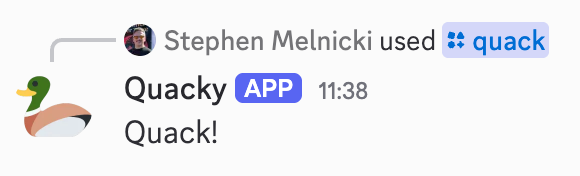
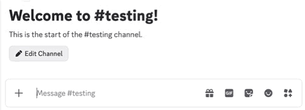

# Quacky

> Will someone please quack me in?

Enjoying your Marble Wednesdays but finding some of the setup a bit repetitive? Want to shout out the boys on their ladder? Start a count down to begin the weekly playlist?

Quacky is a Discord bot that enables you to send reminders, announcements, countdowns, and even quack someone in to the channel. All with a bit of mallard flair! 🦆

## Installation

Quacky's install link is available [here](https://github.com/stephenmelnicki/quacky). Choose the choose the server you'd like to add Quacky to, and authorize.

## Usage

Quacky provides a variety of useful slash commands.

The full list of commands is available [here](https://github.com/stephenmelnicki/quacky).

## Documentation

Quacky's documentation is available at our [website](https://github.com/stephenmelnicki/quacky).
